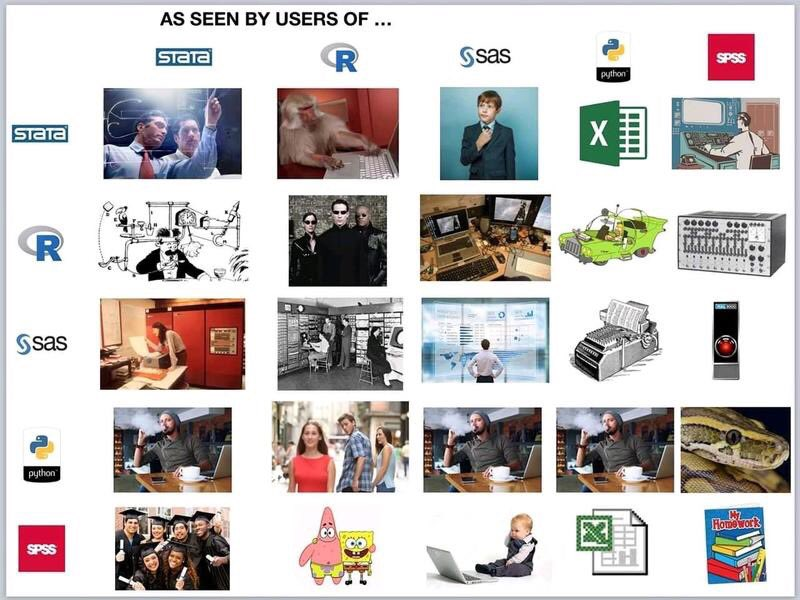

# Plan for Today

1. Introduction

--

2. Workflow in grad school, R and/or Stata

--

3. Getting comfortable with RStudio and RMarkdown

--

4. Some data + plots in R

--

5. Some data + plots in Stata

---

# About Me

+ UCSD undgergrad, now 2nd Year Phd

--

+ Methods/American

--

+ Self-identified Bayesian

--

+ Living proof that everyone can learn this material!

--

+ Resources on Canvas and https://www.bwilden.com/teaching/poli-204b/

---

#Quantitative Workflow

+ Using your research tools *efficiently*, and in a *principled* manner

--

+ **Efficient Workflow:** Am I getting things done quickly and effectively? (i.e. is this fun??)

--

+ **Principled Workflow:** Am I taking the right steps to produce *good* science? 

--

  + Reproducibility
  + Transparency
  
---

#Which tools?

.center[]

---

#R vs Stata

.pull-left[
**R**
+ All-in-one package
+ Other Methods courses
+ Desirable skill outside academia
+ Vibrant community
]

--

.pull-right[
**Stata**
+ Easier to learn if starting from zero
+ Collaboration potential?
+ Replication potential?
]

