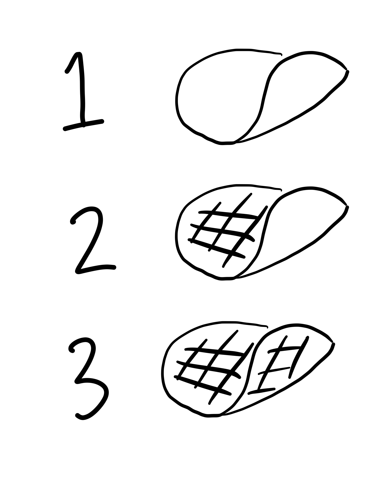
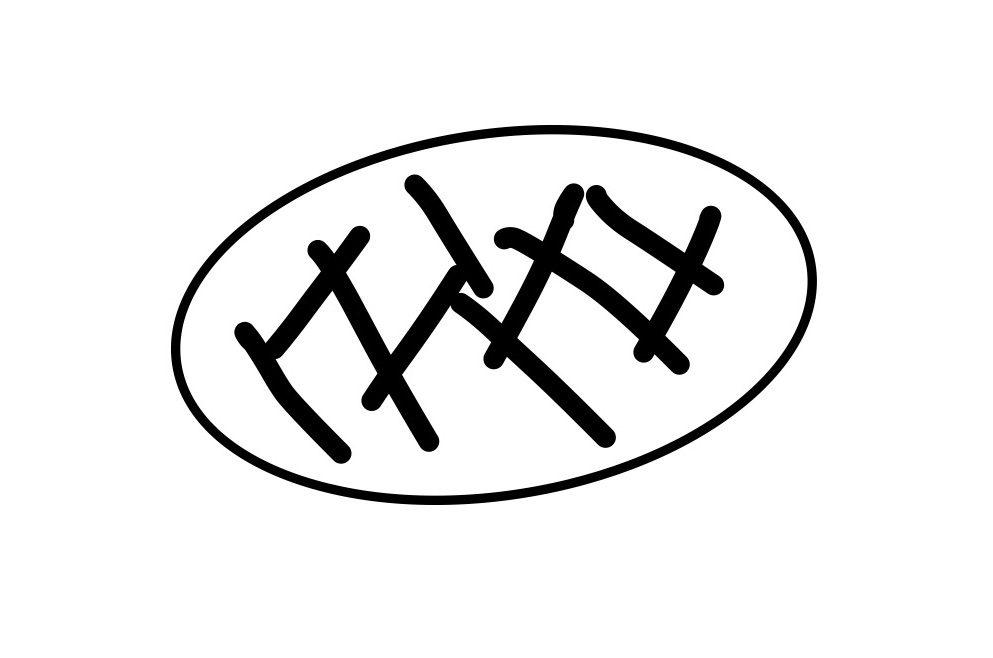

```{r echo=F}
library(emo)
```


<style type="text/css">
.remark-slide-content {
    font-size: 32px;
    padding: 1em 4em 1em 2em;
}
.pancake-adj img {
  width: 80%;
}
.footnote-size {
  font-size: 20px;
}
.equation {
  font-size: 26px;
  text-align: center;
  line-height: 200px;
}
</style>

#Plan for Today

- Probability recap `r ji("meh")`

--

- Simulations in R `r ji("nervous")`

--

- Functions in R `r ji("nervous")`

--

- Simulations **and** Functions in R `r ji("smile")`

---

#Burnt Pancakes

These are your options*

.center[
.pancake-adj[]
]

.footnote-size[
.footnote[
[*] Example adapted from Statistical Rethinking 2nd ed.
]
]

---

#Burnt Pancakes

## This is what you get

.center[]

---

#Conditional Probability!

- When problems are hard, just follow the rules

--

- Pr(want to know|already know)

--

- Bayes' Theorem

---

#Bayes Theorem in Action

.equation[
$\text{Pr}(\text{burnt down} \ | \ \text{burnt up}) = \frac{\text{Pr}(\text{burnt down}, \ \text{burnt up})}{\text{Pr}(\text{burnt up})}$
]

---

#Bayes Theorem in Action

.equation[
$\text{Pr}(\text{burnt down} \ | \ \text{burnt up}) = \frac{\color{red}{\text{Pr}(\text{burnt down}, \ \text{burnt up})}}{\text{Pr}(\text{burnt up})}$
]

.equation[
$\color{red}{\text{Pr}(\text{burnt down}, \ \text{burnt up})} = \ ???$
]

---

#Bayes Theorem in Action

.equation[
$\text{Pr}(\text{burnt down} \ | \ \text{burnt up}) = \frac{\color{red}{\text{Pr}(\text{burnt down}, \ \text{burnt up})}}{\text{Pr}(\text{burnt up})}$
]

.equation[
$\color{red}{\text{Pr}(\text{burnt down}, \ \text{burnt up})} = \frac{1}{3}$
]

--

.right[
`r ji("smile")`
]

---

#Bayes Theorem in Action

.equation[
$\text{Pr}(\text{burnt down} \ | \ \text{burnt up}) = \frac{\text{Pr}(\text{burnt down}, \ \text{burnt up})}{\color{red}{\text{Pr}(\text{burnt up})}}$
]

.equation[
$\color{red}{\text{Pr}(\text{burnt up})} = \ ???$
]

---

#Bayes Theorem in Action

.equation[
$\text{Pr}(\text{burnt down} \ | \ \text{burnt up}) = \frac{\text{Pr}(\text{burnt down}, \ \text{burnt up})}{\color{red}{\text{Pr}(\text{burnt up})}}$
]

.equation[
$\color{red}{\text{Pr}(\text{burnt up})} = \color{blue}{\text{Pr}(\text{BB})(1)} +$
]

---

#Bayes Theorem in Action

.equation[
$\text{Pr}(\text{burnt down} \ | \ \text{burnt up}) = \frac{\text{Pr}(\text{burnt down}, \ \text{burnt up})}{\color{red}{\text{Pr}(\text{burnt up})}}$
]

.equation[
$\color{red}{\text{Pr}(\text{burnt up})} = \text{Pr}(\text{BB})(1) + \color{blue}{\text{Pr}(\text{BU})\left(\frac{1}{2}\right)} +$
]

---

#Bayes Theorem in Action

.equation[
$\text{Pr}(\text{burnt down} \ | \ \text{burnt up}) = \frac{\text{Pr}(\text{burnt down}, \ \text{burnt up})}{\color{red}{\text{Pr}(\text{burnt up})}}$
]

.equation[
$\color{red}{\text{Pr}(\text{burnt up})} = \text{Pr}(\text{BB})(1) + \text{Pr}(\text{BU})\left(\frac{1}{2}\right) + \color{blue}{\text{Pr}(\text{UU})(0)}$
]

---

#Bayes Theorem in Action

.equation[
$\text{Pr}(\text{burnt down} \ | \ \text{burnt up}) = \frac{\text{Pr}(\text{burnt down}, \ \text{burnt up})}{\color{red}{\text{Pr}(\text{burnt up})}}$
]

.equation[
$$\color{red}{\text{Pr}(\text{burnt up})} = \text{Pr}(\text{BB})(1) + \text{Pr}(\text{BU})\left(\frac{1}{2}\right) + \text{Pr}(\text{UU})(0)$$
$$= \color{blue}{\left(\frac{1}{3}\right) + \left(\frac{1}{3}\right)\left(\frac{1}{2}\right) = \frac{1}{2}}$$
]

--

.right[
`r ji("confused")`
]

---

#Bayes Theorem in Action

.equation[
$\text{Pr}(\text{burnt down} \ | \ \text{burnt up}) = \frac{\color{green}{\text{Pr}(\text{burnt down}, \ \text{burnt up})}}{\color{red}{\text{Pr}(\text{burnt up})}}$
]

.equation[
$$\text{Pr}(\text{burnt up}) = \text{Pr}(\text{BB})(1) + \text{Pr}(\text{BU})\left(\frac{1}{2}\right) + \text{Pr}(\text{UU})(0)$$
$$= \left(\frac{1}{3}\right) + \left(\frac{1}{3}\right)\left(\frac{1}{2}\right) = \frac{1}{2}$$
]

.equation[
$$\text{Pr}(\text{burnt down} \ | \ \text{burnt up}) = \frac{\color{green}{1/3}}{\color{red}{1/2}} = \frac{2}{3}$$
]


---

#Simulation and Fake Data

Why is this important to know how to do?

--

**Philosophical**

--

- Natural processes appear "random". Simulation helps us see how this variation plays out

--

- Gain insight into sampling distributions which underlie Frequentist inference

--

- Statistical models, like regression, are probabilistic. Simulations help us understand their predictions

---

#Simulation and Fake Data

**Practical**

--

- You will use simulations all the time in MLE, Causal Inf, Experiments

--

- It sometimes helps you avoid the hard math

  - Bootstrapping

--

- Bayesian inference is all sampling and simulation

--

- Fake data is a way of life

---

##Let's jump into R
